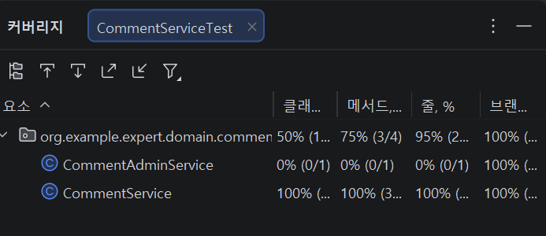
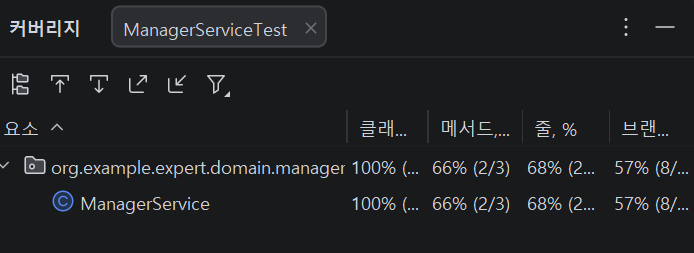
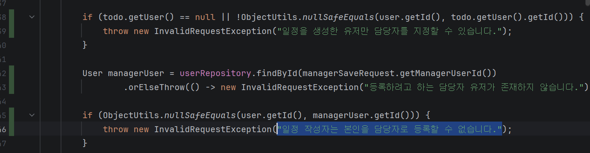

# SPRING ADVANCED
### 0. 프로젝스 세팅 - 에러 분석
/resources/application.yml 파일 생성하여 에러 수정

### 1. ArgumentResolver
WebMvcConfigurer 구현 (addArgumentResolvers 오버라이딩 하여 ArgumentResolver 추가)

### 2. 코드 개선
Early Return  
if문을 상단에 위치시켜 불필요한 코드 실행 막음

불필요한 else if 제거

if문 제거 후 Bean Validation으로 수정
GlobalExceptionHandler에서 validation 예외 처리

### 3. N+1 문제
JOIN FETCH에서 EntityGraph사용으로 수정

### 4. 테스트코드 연습
- 4-1. 메서드 파라미터 순서 변경
- 4-2-1. 메서드 이름 수정, 예상 예외 메시지 수정
- 4-2.2. 예외 종류 수정
- 4-2-3. 서비스 로직에 todo.getUser() == null 추가

### 5. API 로깅
Interceptor와 AOP 둘 다 사용해서 구현해봤습니다.  
deleteComment()는 인터셉터로, changeUserRole은 AOP로 구현

### 7. 테스트 커버리지 일부
CommentServiceTest  
Line Coverage 보충  
  
ManagerServiceTest  
Condition Coverage 보충  
(if문 주황색, 빨간색 부분 보충)  
  
